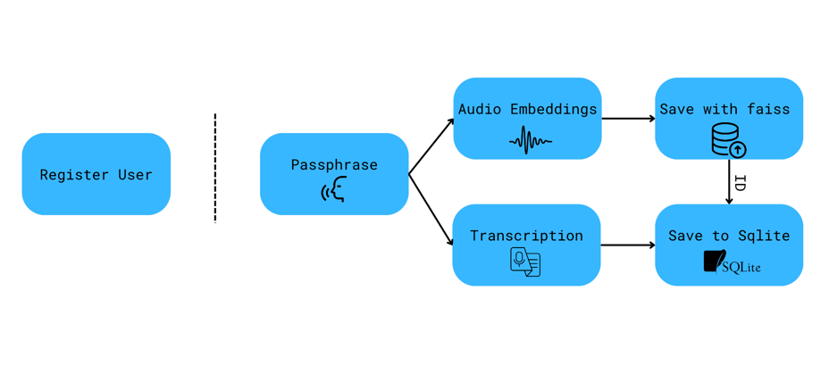
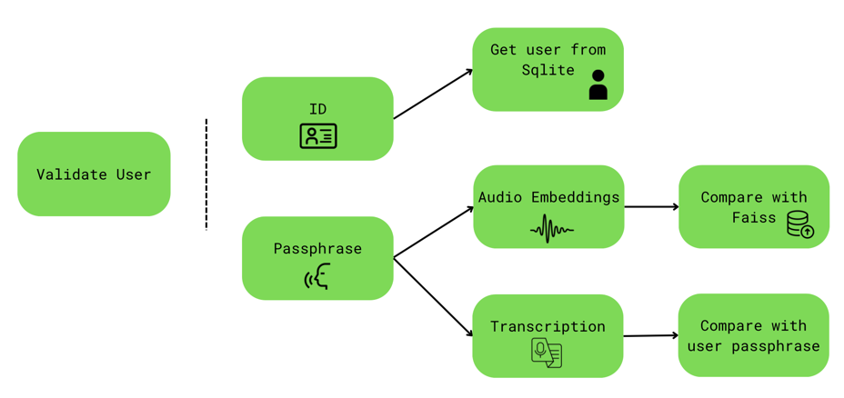

# Speech-Based Access Control System

## System Structure

1. User Registration

2. User Validation


System is built to always ask for option to either register or validate user.

## System work principle

### User Registration
1. User provides his/her passphrase to the system by voice.
2. The system in parallel converts the voice to text, in order to recognize the passphrase, and calculates voice embeddings for future validation.
3. The system stores the voice embeddings in Faiss vector database and receives corresponding embedding ID.
4. The system stores the ID of the user, passphrase and corresponding embedding ID in the Sqlite database.

### User Validation
1. User provides his/her ID to the system by input and passphrase by voice.
2. The system checks whether the user with the provided ID exists in the Sqlite database.
3. If the user exists, the system retrieves the passphrase and corresponding embedding ID from the database.
4. The system in parallel converts the voice to text, in order to recognize the passphrase, and calculates voice embeddings for future validation.
5. The system looks for the closest embedding in the Faiss vector database and retrieves the corresponding embedding ID.
6. The system compares the retrieved embedding ID with the one of the user and if ID's don't match up ends validation.
7. If the ID's match up, the system calculates the normalized Levenshtein distance between the validation passphrase and user passphrase.
8. If the distance is less than the threshold, the system grants access to the user.

## Project Structure

```
.
├── README.md
├── configs
│   ├── main_config.yaml
│   └── quantization_config.yaml
├── core
│   ├── asr_model.py
│   ├── database
│   │   ├── __init__.py
│   │   ├── faiss_database.py
│   │   └── sqlite_database.py
│   └── validator.py
├── main.py
├── output
│   ├── database
│   │   ├── faiss_index.bin
│   │   └── users.db
│   ├── logs
│   │   └── logs.txt
│   └── models
│       ├── wav2vec2-large-960h.onnx
│       └── wav2vec2-large-960h.quant.onnx
├── requirements.txt
├── scripts
│   └── convert_to_onnx.sh
└── utils
    ├── config_utils.py
    ├── logger_utils.py
    └── onnx_converter.py
```

You can change configurations in `configs/main_config.yaml` and `configs/quantization_config.yaml` files due to your requirements.

Output files such as database files, wrapped models and logs are stored in `output` directory.

## Usage

1. Install the required packages:
```bash
pip install -r requirements.txt
```

2. Convert the PyTorch model to ONNX format (and quantize it if needed):
```bash
chmod +x scripts/convert_to_onnx.sh
./scripts/convert_to_onnx.sh
```

Models would be saved to provided in config paths. 

3. Run the main script:
```bash
chmod +x scripts/launch_system.sh
./scripts/launch_system.sh
```

## CLI Interface

```bash
Voice Security System 
1. Register user 
2. Validate user 
0. Exit 
Please select an option: 
```

All the options are self-explanatory.

## References

1. [Wav2Vec 2.0: A Framework for Self-Supervised Learning of Speech Representations](https://arxiv.org/abs/2006.11477)

[//]: # (Link to recemblyzer model)
2. [Recemblyzer: GENERALIZED END-TO-END LOSS FOR SPEAKER VERIFICATION](https://arxiv.org/pdf/1710.10467)

